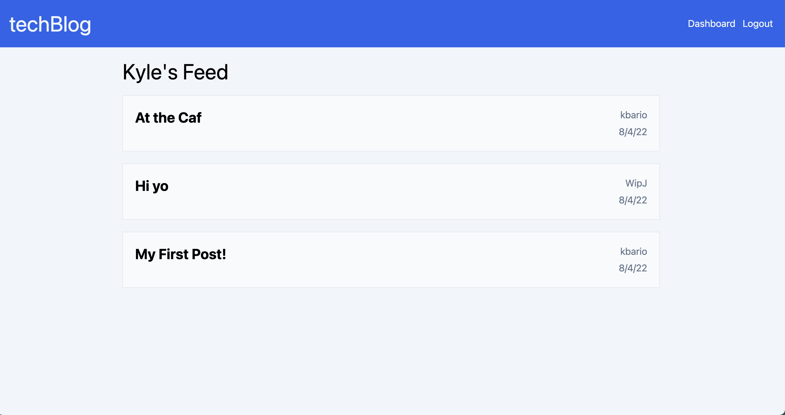
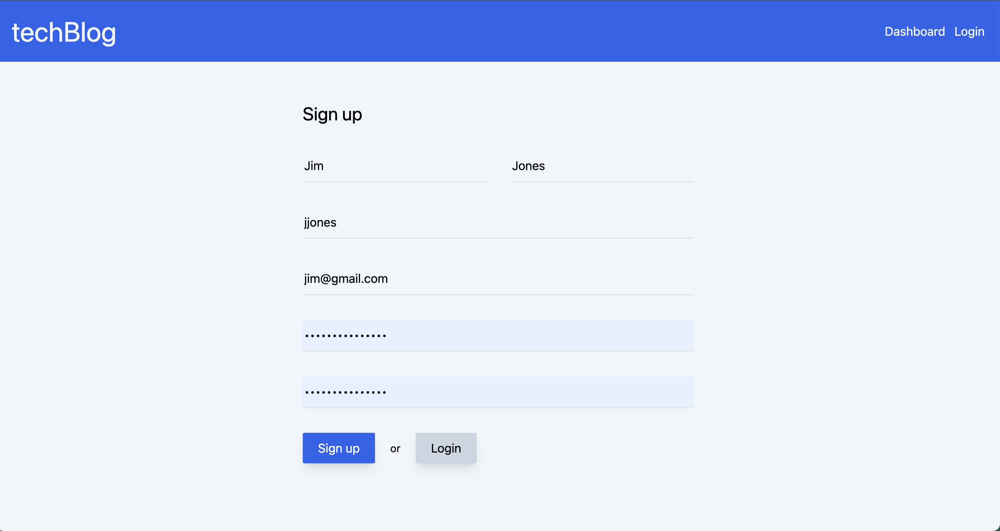
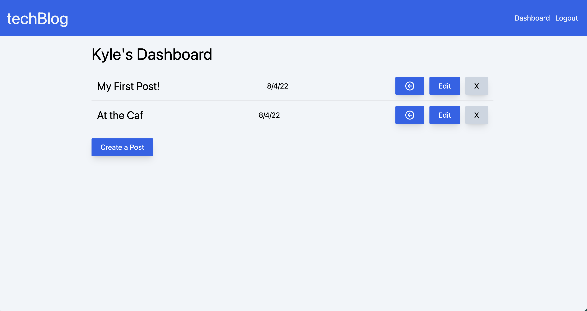
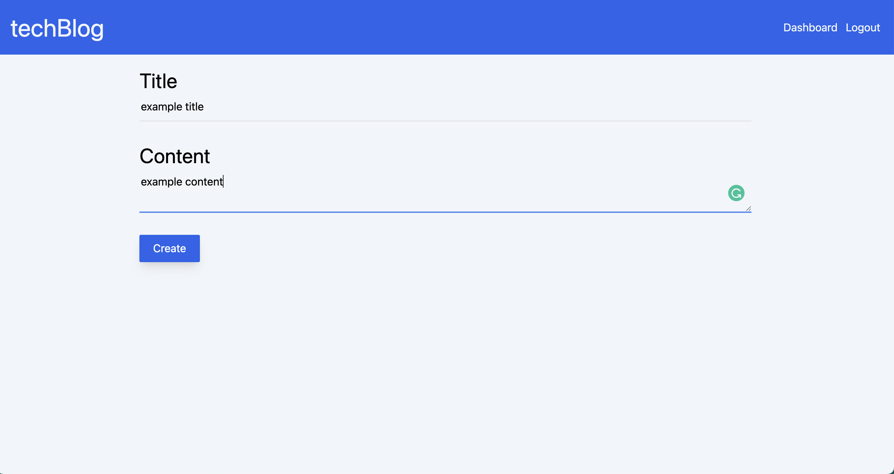
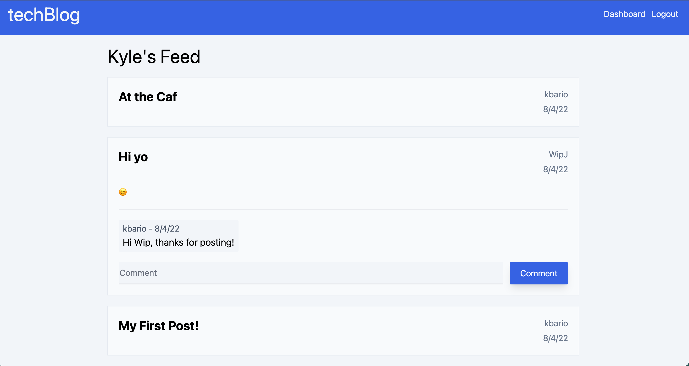

# techBlog
     

## Description
techBlog is a fullstack blogging application deployed on [Heroku](https://www.heroku.com/home). It allows users to create an account, login, create posts and comment on other users posts.

techBlog is created using Node, express, sessions, handlebars and jawsDB.

## Table of Contents    
  - [Installation](#installation)
  - [Usage](#usage)
    - [Signup and Login](#signup-and-login)
    - [Create a Post](#create-a-post)
    - [Commenting on Posts](#commenting-on-posts)
  - [Contribute to techBlog](#contribute-to-techblog)
  - [Tests](#tests)
  - [Questions](#questions)
  - [Credits](#credits)
    - [Third-Party Assets](#third-party-assets)
  - [License](#license)

## Installation
The link to the application is https://kbarios-techblog.herokuapp.com/ but the code can be forked or cloned from the github repo. See code below for cloning, navigate to directory you wish to store the repo on your local machine and run:

    git clone https://github.com/kbario/techBlog.git

## Usage

### Signup and Login

First, for a user to utilise this application, they need to sign up. From the homepage they click either 'dashboard' or 'login'. Dashboard is a protected route meaning only users that are logged in can access it. From the login page, they will be allowed to signup by adding first and last name, a custom username, email, password and password confirm. Upon pressing signup, the user is created and they have full access to create posts and comment on postson the homepage.

### Create a Post

From any page on the application, and when users are signed in, users can click the dashboard link in the navbar and create posts.

Press the create post button which takes you a post creation page. There are inputs for both a title and content of the post. Click create, and the post is created and all users can view it from their homepage feed, and logged in users can comment on it.

**Updating Posts**

Users can also updated posts they've created by clicking the edit button on the dashboard for the respective post. This will prefill the values of the title and content of the post for the user to edit. Then press the 'update' button and the post will be changed.

### Commenting on Posts

Users can comment on both their own and other users's posts.

>Note: Users must be logged in to comment on posts, otherwise, they will simply see the comment bar but it will be disabled for them and they will be prompted to login.

Click on a post you wish to comment on, which will bring up the content of the post, previous comments, and an input for you to write your own comment. Once you are happy with your comment, press the comment button and t will add the comment to the post.

At present, there is no way to update or add comments.

## Contribute to techBlog

All contributions to techBlog are greatly appreciated and contributing is one of the many amazing things about open-source software.

To contribute to techBlog, all we ask is that you're empathic and supportive towards other developers and follow the standard contribution guidelines. Click the banner below for more information.
        

## Tests
Testing is built in an is run before deployment. See testing pass or fail status at the top of the README

## Questions
If you have any questions, feel free to contact me through my [GitHub](https://github.com/kbario/) or [Email me](mailto:kylebario1@gmail.com).

## Credits
Below is a list of links to third-party assets that were used to create this project.

### Third-Party Assets
- http://expressjs.com/
- https://nodejs.dev/
- https://sequelize.org/
- https://handlebarsjs.com/
- https://www.npmjs.com/package/express-session

## License
Licensed under the [MIT](./LICENSE.txt) license.

---
This README was created with [Gener8aREADME](https://github.com/kbario/Gener8aREADME).
